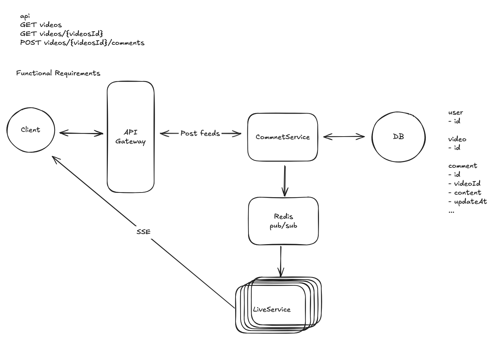

# Week 10
# FacebookLiveComments 시스템 설계 요약

Functional Requirements
Core Requirements
- Viewers can post comments on a Live video feed.
- Viewers can see new comments being posted while they are watching the live video.
- Viewers can see comments made before they joined the live feed.
  Below the line (out of scope):
- Viewers can reply to comments
- Viewers can react to comments

Non-Functional Requirements
Core Requirements
- The system should scale to support millions of concurrent videos and thousands of comments per second per live video.
- The system should prioritize availability over consistency, eventual consistency is fine.
- The system should have low latency, broadcasting comments to viewers in near-real time (< 200ms end-to-end latency under typical network conditions)
  Below the line (out of scope):
- The system should be secure, ensuring that only authorized users can post comments.
- The system should enforce integrity constraints, ensuring that comments are appropriate (ie. not spam, hate speech, etc.)

직접 작성

1. 비효율적인 전략
   1. 비효율적인 Pub/Sub (모든 서버가 모든 댓글을 받음)
       이 방식은 댓글 시스템을 Pub/Sub(발행/구독) 모델을 사용해 구현합니다.
       - 연결 관리: 사용자가 라이브 비디오를 시청하기 위해 서버에 연결하면, 서버는 그 사용자의 연결 정보(sseConnection)를 특정 비디오 ID(liveVideoId)에 매핑하여 로컬 메모리에 저장합니다.
       - 댓글 발행: 새 댓글이 생성되면, Comment Management Service는 이 댓글을 Pub/Sub 시스템의 하나의 공통 채널에 발행합니다.
       - 댓글 수신 및 전달: 모든 Realtime Messaging Server는 이 공통 채널을 구독하고 있습니다. 따라서 모든 서버는 모든 댓글을 수신합니다. 각 서버는 댓글이 어떤 비디오의 것인지 확인한 후, 자신에게 연결된 해당 비디오 시청자들에게만 댓글을 전달합니다.
       - 문제점: 모든 서버가 모든 댓글을 받아야 하므로 매우 비효율적입니다. 한 서버에 liveVideoId1의 시청자만 연결되어 있더라도, 그 서버는 liveVideoId2, liveVideoId3 등 다른 모든 비디오의 댓글까지 받아 처리해야 합니다. 이는 막대한 연산 자원을 낭비합니다.

   2. 개선된 Pub/Sub (해시 기반 채널 분할)
   이 방식은 첫 번째 모델의 비효율성을 해결하기 위해 채널을 여러 개로 분할합니다.
   - 채널 분할: 전체 댓글 스트림을 비디오 ID(liveVideoId)에 따라 여러 채널로 나눕니다.
   - 해싱: 해싱 함수를 사용해 비디오 ID를 특정 채널에 매핑합니다. 예를 들어, hash(liveVideoId) % N (N은 채널의 총 개수)을 사용하여 댓글이 어떤 채널로 갈지 결정합니다.
   - 채널 구독: 각 Realtime Messaging Server는 자신이 담당하는 비디오 ID에 해당하는 채널만 구독합니다. 예를 들어, liveVideoId1의 시청자를 담당하는 서버는 hash(liveVideoId1) % N 채널만 구독합니다.
   - 댓글 전달: 새 댓글이 오면, 해당 비디오 ID에 맞는 채널에 발행되고, 필요한 서버만 이 댓글을 수신하여 시청자에게 전달합니다.
   - 문제점: 로드 밸런서가 round-robin 방식으로 서버에 시청자를 분배하면, 한 서버에 liveVideoId1, liveVideoId2, liveVideoId3 등 여러 비디오의 시청자가 뒤섞여 연결될 수 있습니다. 이 경우, 그 서버는 결국 여러 채널을 구독해야 하므로 첫 번째 접근법과 유사한 비효율성 문제를 다시 겪게 됩니다.
 
````
두 가지 해결 전략
1. Intelligent Routing via Hashing (해시 기반 지능형 라우팅)
   이 방법은 특정 라이브 비디오의 모든 시청자를 항상 동일한 서버로 보내는 것입니다.
    - 어떻게 작동하는가: 요청에 포함된 liveVideoId를 사용해 해시 함수를 적용합니다. 이 해시 값에 따라 요청을 특정 서버로 보냅니다.
    - 장점: 간단하고 효율적입니다. 추가적인 서비스(예: 디스패처 서비스)가 필요 없습니다.
    - 단점: 특정 비디오에 시청자가 몰릴 경우, 해당 서버에만 부하가 집중될 수 있습니다(핫스팟 문제).

2. Dynamic Lookup via Coordination Service (조정 서비스를 통한 동적 조회)
   이 방법은 어떤 서버가 특정 비디오를 담당하는지 실시간으로 관리하는 것입니다.
    - 어떻게 작동하는가: Zookeeper 같은 분산 조정 서비스에 (liveVideoId -> serverId)와 같은 매핑 정보를 저장합니다. 로드 밸런서는 요청이 들어올 때마다 Zookeeper에 질의하여 해당 비디오의 시청자를 담당하는 서버를 찾고, 그 서버로 요청을 보냅니다. 서버가 추가되거나 제거되면 Zookeeper의 정보가 동적으로 업데이트됩니다.
    - 장점: 트래픽 변화에 유연하게 대응할 수 있습니다. 핫스팟이 발생하면 다른 서버로 매핑을 변경하여 부하를 분산시킬 수 있습니다.
    - 단점: Zookeeper 같은 추가적인 시스템을 도입해야 하므로 운영 복잡성이 높아집니다. 캐시 관리, 장애 처리 등 고려해야 할 요소가 많습니다.

````


1. Pub/Sub 방식 (기존)
  이 방식은 댓글 시스템에서 흔히 사용되는 표준 모델입니다.
  - 댓글 생성: 누군가 새 댓글을 달면, 댓글 생성 서비스는 그 댓글을 특정 '토픽'(예: 'liveVideoId-1234' 토픽)에 발행(publish)합니다.
  - 구독: 실시간 메시징 서버들은 필요한 토픽을 미리 구독(subscribe)하고 있습니다. 즉, 'liveVideoId-1234'의 시청자들을 담당하는 서버는 이 토픽을 구독하고 있습니다.
  - 수신: 댓글이 발행되면, 해당 토픽을 구독하고 있는 모든 서버들이 메시지를 받습니다. 그러면 각 서버는 자신에게 연결된 시청자들에게 댓글을 전달합니다.
  - 장점: 댓글 생성 서비스는 어떤 서버가 댓글을 받아야 하는지 알 필요가 없어 단순합니다. 메시지를 발행하기만 하면 됩니다.
  - 단점: 구독 관리와 확장성 복잡성이 증가할 수 있습니다. 예를 들어, 토픽이 수만 개로 늘어나면 모든 서버가 모든 토픽을 구독할 수 없어 비효율적일 수 있습니다.

2. Dispatcher Service 방식 (대안)
  이 방식은 Pub/Sub 모델을 뒤집은 것입니다.
  - 서버 등록: 각 실시간 메시징 서버가 온라인이 되면, 자신이 어떤 비디오를 담당할지 디스패처 서비스에 등록합니다. 디스패처는 이 정보를 맵(map) 형태로 저장합니다. (liveVideoId -> server_id)
  - 댓글 전달: 새 댓글이 들어오면, 댓글 생성 서비스는 디스패처 서비스에 "이 댓글을 어디로 보내야 해?"라고 물어봅니다.
  - 직접 라우팅: 디스패처 서비스는 맵을 보고 해당 비디오를 담당하는 서버의 주소를 알려주고, 댓글을 그 서버로 직접 전달합니다.
  - 장점: 댓글을 요한 서버에만 직접 보낼 수 있어 효율적입니다. 불필요하게 모든 서버에 메시지를 브로드캐스팅할 필요가 없습니다.
  - 단점: 디스패처 서비스의 정확성과 일관성을 유지하는 것이 매우 중요하고 복잡합니다.
  - 정확성: 시청자 수가 급격히 늘어나 서버가 추가될 때, 디스패처의 맵이 빠르게 업데이트되지 않으면 잘못된 서버로 댓글을 보낼 수 있습니다.
  - 일관성: 여러 개의 디스패처 인스턴스가 있을 경우, 각 인스턴스가 동일한 맵 정보를 가지도록 동기화해야 합니다. 이를 위해 Zookeeper나 etcd 같은 분산 코디네이션 서비스가 필요합니다.
