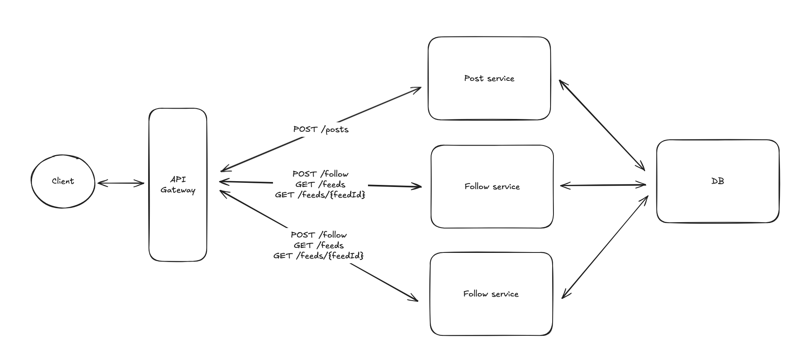
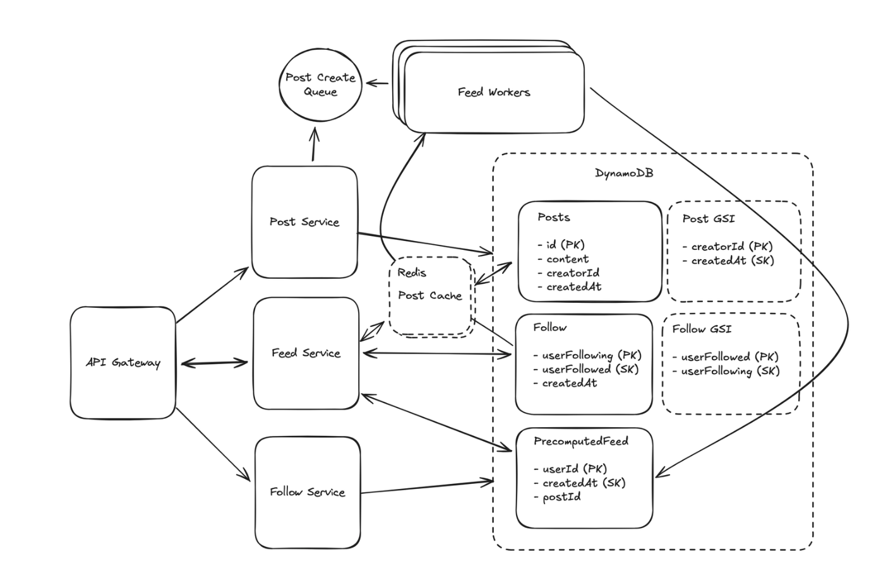

# Week 10
# FacebookNewFeed 시스템 설계 요약

Functional Requirements
Core Requirements
- Users should be able to create posts.
- Users should be able to friend/follow people.
- Users should be able to view a feed of posts from people they follow, in chronological order.
- Users should be able to page through their feed.
  Below the line (out of scope):
- Users should be able to like and comment on posts.
- Posts can be private or have restricted visibility.
- For the sake of this problem (and most system design problems for what it's worth), we can assume that users are already authenticated and that we have their user ID stored in the session or JWT.

Non-Functional Requirements
Core Requirements
- The system should be highly available (prioritizing availability over consistency). We'll tolerate up to 1 minute of post staleness (eventual consistency).
- Posting and viewing the feed should be fast, returning in < 500ms.
- The system should be able to handle a massive number of users (2B).
- Users should be able to follow an unlimited number of users, users should be able to be followed by an unlimited number of users.

직접 작성

영상

문제: Fan-out 문제
Fan-out은 하나의 이벤트(게시물 생성)가 여러 대상(팔로워의 피드)에 영향을 미치는 상황을 의미합니다. 팔로워가 수백만 명인 사용자가 게시물을 올리면, 그 게시물을 수백만 개의 피드에 써야 합니다.
최악의 시나리오: 게시물 생성 서비스가 수백만 개의 쓰기 요청을 한 번에 보냅니다. 이는 시스템에 엄청난 부하를 줘서 실패할 가능성이 높고, 특정 서버에만 부하가 몰려 비효율적입니다.

해결책 1: 비동기 워커를 이용한 Fan-out
게시물 생성 즉시 모든 피드에 쓰는 대신, 비동기적으로 처리하여 부하를 분산하는 방법입니다.
작동 방식:
새 게시물이 생성되면, Post Service는 **메시지 큐(예: SQS)**에 "이 게시물을 팔로워들에게 푸시하라"는 메시지를 보냅니다.
Feed Worker들이 큐에서 메시지를 가져옵니다.
각 워커는 게시물 작성자의 모든 팔로워 목록을 조회하고, 각 팔로워의 피드에 새 게시물을 추가합니다.

문제점:
팔로워가 많은 계정(예: 수백만 명)의 메시지가 큐에 들어오면, 해당 메시지를 처리하는 워커 한두 대가 엄청난 양의 작업을 처리해야 합니다.
워커들 간의 작업량이 불균형해지므로, 시스템의 확장성과 효율성이 떨어집니다.

해결책 2: 하이브리드 Fan-out (최적의 방법)
이 방법은 비동기 워커를 사용하면서도, 팔로워가 많은 계정의 특성을 고려해 읽기(Read) 시점에 Fan-out을 일부 수행합니다. 즉, Fan-out을 쓰기(Write) 시점과 읽기(Read) 시점으로 나눕니다.

작동 방식:
쓰기 시점: Feed Worker가 피드를 업데이트할 때, 일반 사용자의 피드에만 게시물을 추가합니다.
구분: 팔로워가 많은 계정(예: 100만 명 이상)은 Follow 테이블에 특별한 플래그를 추가하여, 이 계정의 게시물은 미리 피드에 쓰지 않도록 표시합니다.
읽기 시점: 사용자가 자신의 피드를 열면, Feed Service는 두 가지 작업을 수행합니다.
미리 계산된 피드 조회: 일반 계정의 게시물들로 구성된 피드를 가져옵니다.
실시간 조회: 팔로워가 많은 계정의 최신 게시물을 별도로 조회합니다.
합병(Merge): 두 정보를 합쳐서 사용자에게 최종 피드를 보여줍니다.
장점:
쓰기 부하 감소: 수백만 개의 피드에 매번 쓰기 작업을 할 필요가 없어, 시스템의 쓰기 부하가 대폭 줄어듭니다.
확장성: 핫스팟 계정 때문에 워커들이 과부하되는 문제를 해결합니다.

단점:
읽기 부하 증가: 피드를 읽을 때 추가적인 연산(조회, 병합)이 필요하므로, Feed Service의 부하가 늘어납니다.

결론
이 텍스트는 **"만능 해결책은 없다"**는 것을 보여줍니다. Fan-out 문제를 해결하기 위해, 모든 게시물을 쓰기 시점에 처리하는 대신, 특정 계정은 읽기 시점에 처리하는 하이브리드 방식을 적용하여 시스템의 효율성과 확장성을 높이는 설계 원칙을 제시하고 있습니다.
