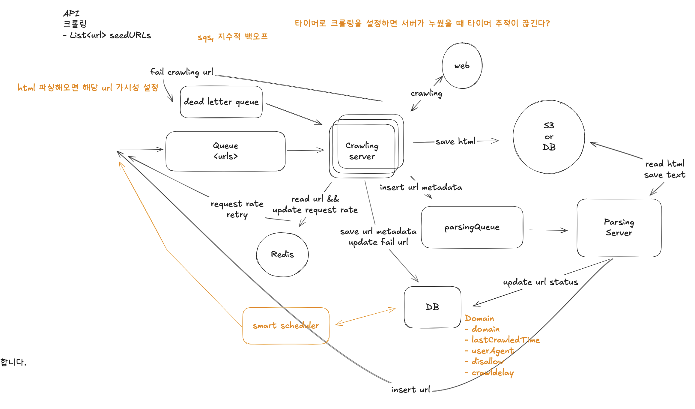

# Week 6
# WebCrawler 시스템 설계 요약

## 1. 기능적 요구사항
1. 핵심 요구사항
    - 주어진 초기 URL 목록(seed URLs)에서 웹 크롤링을 시작해야 합니다.
    - 각 웹 페이지에서 텍스트 데이터를 추출하고, 이 텍스트를 나중에 처리할 수 있도록 저장해야 합니다.

2. 제외 범위 (out of scope)
    - 텍스트 데이터를 실제로 처리하는 작업 (예: LLM 학습 등)
    - 텍스트가 아닌 데이터 처리 (예: 이미지, 비디오 등)
    - 동적 콘텐츠 처리 (예: JavaScript로 렌더링되는 페이지)
    - 인증 처리 (예: 로그인해야 볼 수 있는 페이지 등)

## 2. 비기능적 요구사항
- 웹에는 약 100억 개(10B)의 페이지가 존재합니다. 
- 각 페이지의 평균 크기는 2MB입니다. 
- 회사는 크롤링 시작 후 5일 이내에 데이터를 사용할 수 있기를 원합니다.

1. 핵심 요구사항
   내결함성(Fault tolerance): 시스템이 장애를 우아하게 처리하고, 크롤링 중단 없이 진행 상황을 복구할 수 있어야 합니다.
   정중함(Politeness): robots.txt 규칙을 준수하고, 웹사이트 서버에 과도한 부하를 주지 않도록 해야 합니다.
   효율성(Efficiency): 5일 이내에 웹을 크롤링할 수 있어야 합니다.
   확장성(Scalability): 100억 개의 웹 페이지를 처리할 수 있어야 합니다.

2. 제외 범위
   보안(Security): 악의적인 행위자로부터 시스템을 보호하는 기능
   비용(Cost): 시스템을 예산 내에서 운영하는 기능
   컴플라이언스(Compliance): 법적 요구사항 및 개인정보 보호 규정 준수

---

Inbox
- 오프라인 사용자에게 전달할 채팅 내역을 따로 관리하는 부분을 누락
Client
- 사용자의 세션 정보에 클라이언트 정보를 추가해야 여러 기기를 사용하는 경우를 처리
