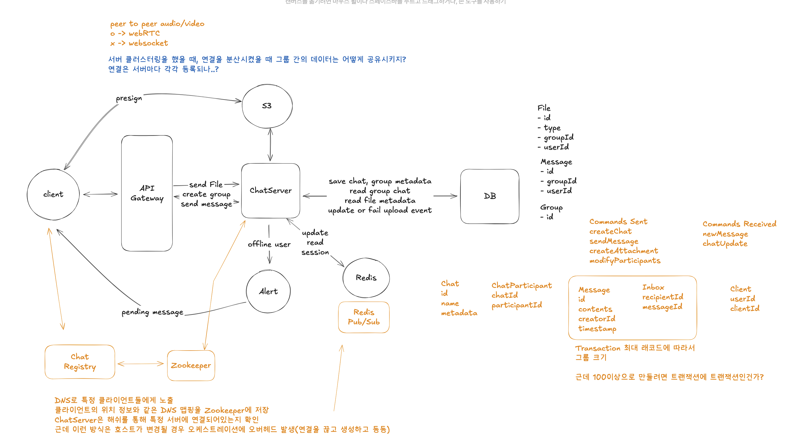

# Week 6
# WhatsApp 시스템 설계 요약

## 1. 기능적 요구사항
- 그룹 채팅 시작하기: 사용자가 다른 사람이나 그룹과 채팅을 시작할 수 있어야 합니다. (두 명의 그룹도 일대일 메시지로 간주됨).
- 메시지 전송 및 수신: 사용자가 다른 사용자에게 메시지를 보내고 받을 수 있어야 하며, 메시지는 해당 채팅의 모든 구성원에게 전달되어야 합니다.
- 미디어 첨부파일 지원: 비디오 및 오디오 첨부파일을 메시지로 보낼 수 있어야 합니다.
- 오프라인 시 메시지 접근: 사용자가 오프라인 상태였더라도 다시 연결했을 때 모든 메시지를 받을 수 있어야 합니다.

## 2. 비기능적 요구사항
- 낮은 지연 시간 (Low Latency): 메시지가 짧은 시간 내에 도착해야 합니다. WhatsApp의 경우 500밀리초의 지연 시간을 가정합니다. 이는 설계에서 예산으로 사용될 수 있습니다.
- 메시지 전달 보장 (Guaranteed Delivery): 메시지가 반드시 수신자에게 전달되어야 합니다. 메시지를 보냈는데 받지 못하는 일은 없어야 합니다.
- 높은 처리량 (High Throughput): WhatsApp은 수십억 명의 사용자를 지원해야 하므로, 시스템은 많은 메시지를 처리할 수 있어야 합니다.
- 불필요한 메시지 저장 안함 (No Unnecessary Message Storage): 개인 정보 보호를 위해 메시지는 기능 요구사항을 수행할 수 있을 만큼만 서버에 저장되어야 합니다. 데이터는 "유독성 슬러지"와 같아서 보관하고 싶지 않은 것이라고 비유됩니다.
- 결함 허용 (Fault Tolerance): 개별 구성 요소의 실패가 전체 앱을 다운시키지 않아야 합니다. 특히 WhatsApp과 같은 거대한 시스템에서는 중요합니다.

---

시드 url로 시작
크롤링 서버에서 html을 크롤링해오고, 파싱까지 진행하는 것은 무겁다고 생각
- html 크롤링/파싱 중 에러가 발생한 경우 재처리 프로세스
- 파싱 에러에서 롤백 프로세스
- 또한 진행 중인 html, 텍스트 파일이 메모리를 점유
- 페이지당 2MB인데, 파싱처리를 하는 동안은 압축이 안 될텐데
- 10억개를 최대한 빠르고 효율적으로 처리하고, 확장성을 고려하면 분리하는게 맞다고 생각

크롤링 서버에서 url을 큐에 받아오면 url이 저장되어 있는지 체크
url이 없거나 재시도 필요한 상태면 크롤링 진행
html 크롤링 해오면 S3에 저장하고 DB에 메타데이터 저장, 파싱 프로세스 진행

크롤링 재시도는 횟수 제한, 횟수 만료시 DLQ 삽입, DB에서 url 상태를 변경
- 영상에선 파싱 서버는 DB에 url이 존재하는지만 확인하고 url 업데이트는 크롤링 서버에서 진행

레디스에서 url별로 속도 제한
- 영상은 도메인이란 엔티티가 있고, 도메인을 기준으로 TTL 설정
- 10억개의 url을 등록하는 것은 조금.. 그렇다 생각했음..
