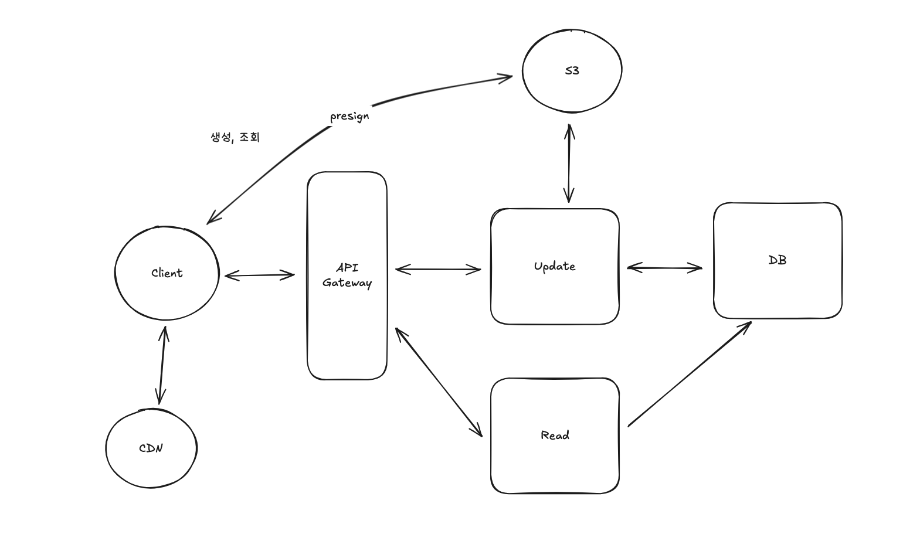
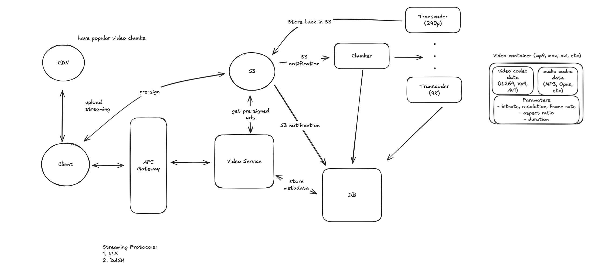

# Week 8
# Youtube 시스템 설계 요약

## 1. 기능적 요구사항
◦ 사용자는 동영상을 업로드할 수 있어야 합니다.
◦ 매일 약 1백만 건의 업로드
◦ 매일 약 1억 명의 활성 사용자
◦ 최대 동영상 크기는 256GB (실제 YouTube와 동일). 이 큰 동영상 크기는 설계 시 중요한 고려사항이 됩니다.
## 2. 비기능적 요구사항
◦ 가용성 우선 (Availability over Consistency): 동영상 업로드 시 독일에서 업로드한 동영상이 미국에서 즉시 보이지 않아도 되며, 몇 초에서 몇 시간까지 전파하는 데 시간이 걸려도 괜찮습니다. 사용자가 현재 콘텐츠를 볼 수 있는 가용성이 더 중요하며, 동영상 업로드 자체는 최종적 일관성(eventual consistency)을 가질 수 있습니다.
◦ 대용량 동영상 업로드 및 스트리밍 지원: 최대 256GB 크기의 동영상 지원이 필요합니다.
◦ 낮은 지연 시간 스트리밍 (Low Latency Streaming): 동영상을 클릭했을 때 500밀리초 이내에 첫 픽셀을 볼 수 있어야 합니다.
◦ 낮은 대역폭 환경 지원: 낮은 대역폭 연결에서도 동영상을 빠르게 볼 수 있어야 합니다.
◦ 확장성 (Scalability): 매일 1백만 건의 업로드와 1억 건의 조회수를 처리할 수 있도록 시스템이 확장 가능해야 합니다.

---
직접 작성

영상

