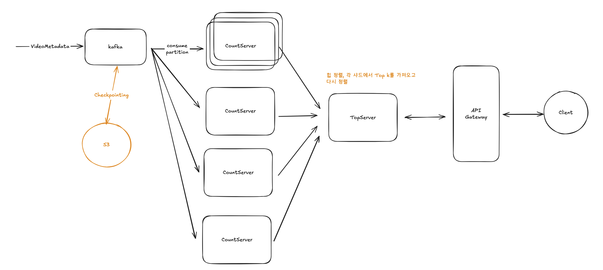
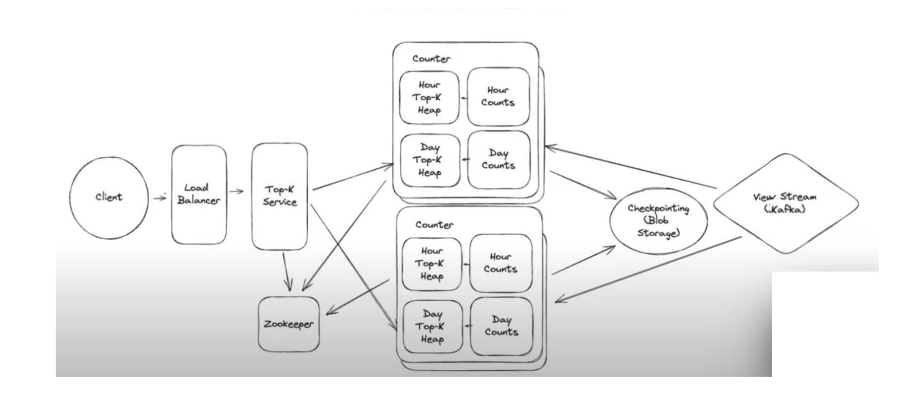

# Week 8
# YoutubeTopK 시스템 설계 요약

## 1. 기능적 요구사항
1. 핵심 요구사항
   ◦ 주어진 질의(query)에 대해 사이트에서 가장 많이 조회된 상위 K개의 동영상을 제공해야 합니다.
   ◦ 서비스는 시간 주기(예: 시간, 일, 월)를 매개변수로 받아 해당 기간의 Top-K 동영상을 제공할 수 있어야 합니다.
   ◦ K의 최대값은 1,000개 동영상입니다.
   ◦ "모든 시간(all time)" Top-K 동영상 조회 기능을 지원해야 합니다.
   ◦ 시간 윈도우는 현재 시간에 고정되고 움직이는 **슬라이딩 윈도우(sliding window)**여야 합니다.

2. 제외 범위 (out of scope)
   ◦ 임의의 시작 시점(arbitrary starting points)을 지원할 필요는 없습니다 (현재 시간에 고정).
   ◦ 사용자 및 동영상 카테고리에 대한 처리는 이 서비스의 범위가 아닙니다.
   ◦ 동영상 메타데이터(예: 동영상 이름, 설명)는 이 서비스에서 직접 포함하지 않으며, 다운스트림 애그리게이터나 클라이언트가 별도로 처리한다고 가정합니다.
   ◦ API 게이트웨이, 속도 제한(rate limiting), 인증(authentication) 등은 초기 설계 논의에서 제외됩니다.
   ◦ 정확한(precise) 결과가 요구되므로, 초기에는 근사치(approximations)를 허용하지 않습니다. (소스는 나중에 근사치를 허용할 경우의 대안을 설명하지만, 이 문제의 기본 요구사항에서는 정확성을 전제로 함).

## 2. 비기능적 요구사항
• 일관성/최신성 (Consistency/Staleness): 동영상 조회수가 발생한 후 Top-K 계산에 1분(60초) 이내에 반영되어야 합니다. 이 요구사항은 캐싱이나 사전 계산과 같은 설계 결정에 직접적인 영향을 미칩니다.
• 읽기 속도 (Read Speed): Top-K 서비스는 유튜브 첫 페이지에 표시될 것이므로, 매우 빠르게 결과를 반환해야 합니다 (낮은 지연 시간 보장).
• 규모 (Scale):
◦ 조회수: 하루에 약 1천억(100 billion) 조회수를 처리해야 하며, 이는 초당 약 100만(1 million) 조회수에 해당합니다.
◦ 동영상 수: 하루에 약 100만(1 million) 개의 동영상이 생성될 수 있으며, 10년 기준으로 약 36억 5천만(3.65 billion) 개의 동영상이 존재할 수 있다고 추정됩니다.
◦ 메모리 요구사항: 모든 동영상의 조회수 카운트 저장을 위한 메모리 사용량은 약 100GB로, 합리적인 서버의 메모리 내에서 관리가 가능하다고 판단됩니다.
• 정확성 (Accuracy): Top-K 결과는 정확해야 합니다 (근사치 불허).
• 가용성 (Availability): 서비스는 고가용성을 제공해야 하며, 장애 발생 시 로드 밸런싱, 체크포인팅(checkpointing) 등을 통해 복구 및 지속적인 서비스 제공이 가능해야 합니다.

---
직접 작성

영상

