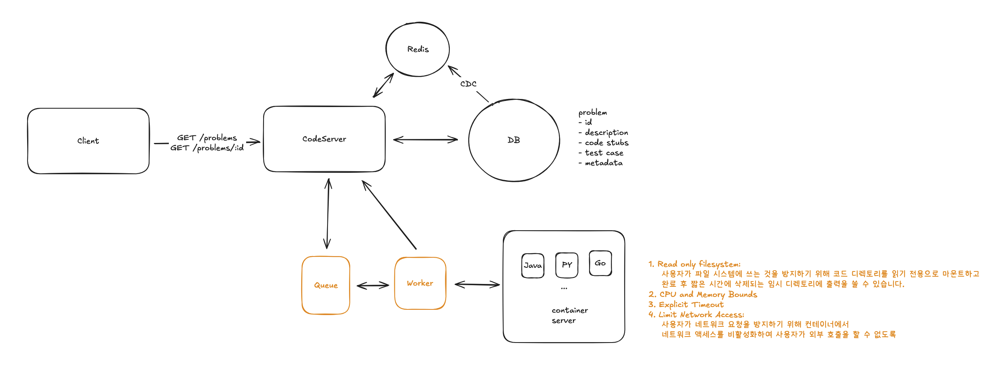

# Week 8
# Youtube 시스템 설계 요약

Functional Requirements
1. Users should be able to view a list of coding problems.
2. Users should be able to view a given problem, code a solution in multiple languages.
3. Users should be able to submit their solution and get instant feedback.
4. Users should be able to view a live leaderboard for competitions.

Non-Functional Requirements
1. The system should prioritize availability over consistency.
2. The system should support isolation and security when running user code.
3. The system should return submission results within 5 seconds.
4. The system should scale to support competitions with 100,000 users.

Defining the Core Entities
1. Problem: This entity will store the problem statement, test cases, and the expected output.
2. Submission: This entity will store the user's code submission and the result of running the code against the test cases.
3. Leaderboard: This entity will store the leaderboard for competitions.

API or System Interface
1. GET /problems?page=1&limit=100 -> Partial<Problem>[]
2. GET /problems/:id?language={language} -> Problem
3. POST /problems/:id/submit -> Submission
{
code: string,
language: string
}
4. GET /leaderboard/:competitionId?page=1&limit=100 -> Leaderboard
---

직접 작성

영상

