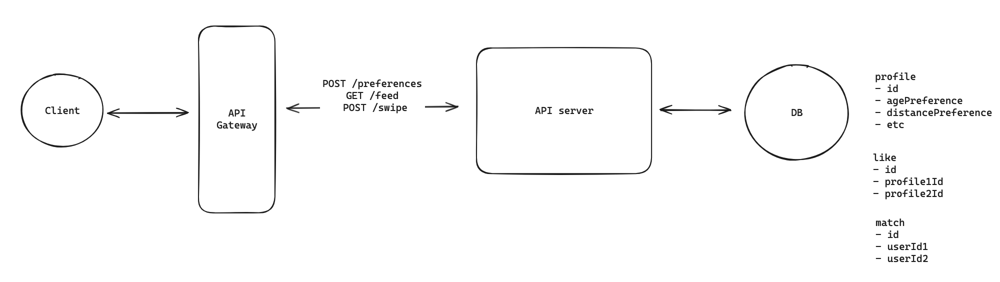
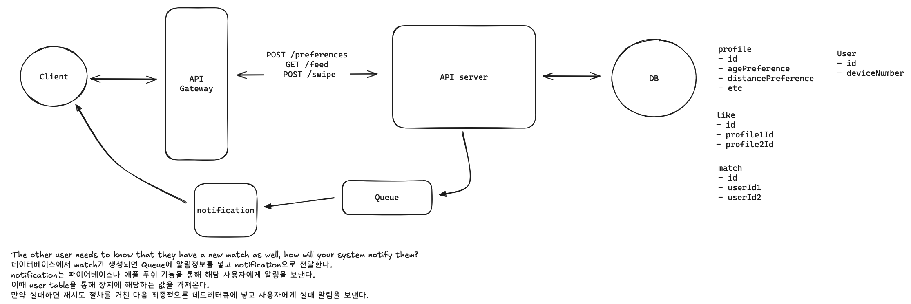
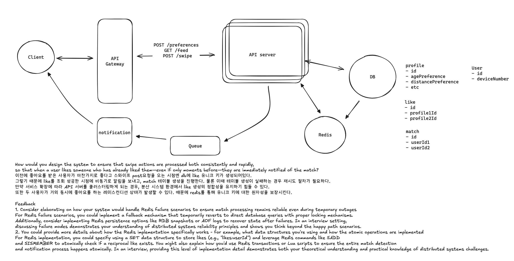
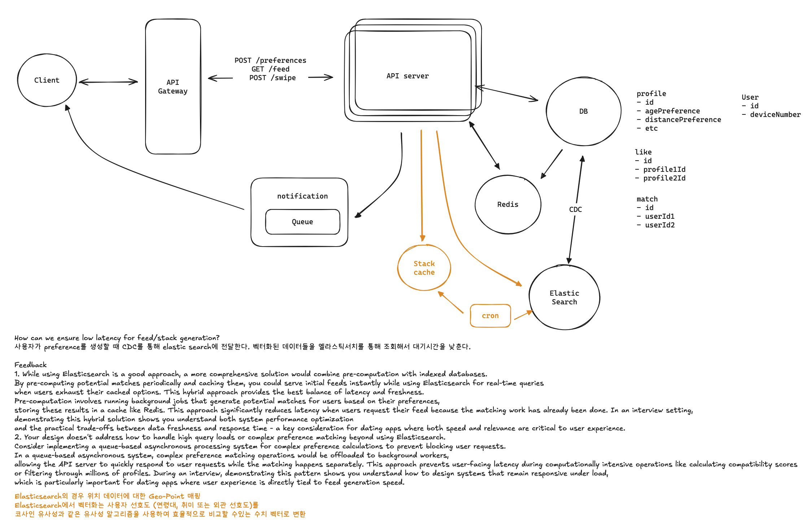
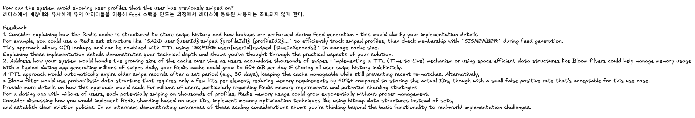

# Week 8
# YoutubeTopK 시스템 설계 요약

## Functional Requirements
   1. Users can create a profile with preferences (e.g. age range, interests) and specify a maximum distance.
   2. Users can view a stack of potential matches in line with their preferences and within max distance of their current location.
   3. Users can swipe right / left on profiles one-by-one, to express 'yes' or 'no' on other users.
   4. Users get a match notification if they mutually swipe on each other.
   5. The scale of the system is:20M daily active users

## Non-Functional Requirements
### 내 답변:
1. 가용성보단 일관성이 더 중요하다.
2. 응답속도가 100ms 이내여야 한다.
3. 지역별 급증하는 트래픽을 감당해야 한다.

### Feedback
   Consider providing more context for why consistency is more important than availability specifically for Tinder
   - In a dating app like Tinder, if User A likes User B who has already liked User A, both users should immediately see they've matched.
     If the system prioritized availability over consistency, a user might not see their match right away, creating a poor user experience and potentially missing connection opportunities.
     During an interview, explaining this specific trade-off shows you understand not just abstract system qualities
     but their real impact on user experience and business outcomes in this particular domain.

## Defining the Core Entities
- user
- match
- like
## API or System Interface
1. get stack
GET /feed?lat={lat}&long={long}&distance={distance} -> User[]
2. Set preferences
POST /preferences
{
maxDistance: number,
ageRange: { min: number, max: number },
interests: string[
}

3. Swipe
POST /swipe/{targetUserId}
{
decision: 'yes' | 'no' (or 'right | 'left', or similar)
}

---

### 1. How will users be able to get a stack of recommended matches based on their preferences?

``
좋아요로 스와이프하면 like 테이블에 스와이프 한 사람 프로필 아이디와 보여진 사람의 프로필 아이디를 유니크 키로 설정하여 데이터베이스에 저장한다. 
그리고 feed에서 유저 정보가 조회될 때 like가 있는지 체크해서 응답에 포함시킨다. 
만약 match된다면 db match table에 해당 유저들의 아이디를 포함하여 생성하고, 알림을 보낸다.
``

Feedback
1. Consider adding a timestamp field to the like table to track when swipes occurred, which would be useful for analytics and potentially for sorting matches by recency
   - Timestamps on swipe actions would allow you to analyze user behavior patterns over time, such as peak usage hours or how quickly users find matches.
   - During system design interviews, demonstrating awareness of data that enables future analytics shows foresight beyond basic functionality.
   - Additionally, timestamps could enable features like "most recent likes first" in the matching algorithm or implementing time-based expiration of old swipes to manage database growth.
2. Adding a 'direction' field to the like table would help distinguish between right (like) and left (dislike) swipes, providing more data for recommendation algorithms
   - Currently, your design only captures that a swipe occurred between two users,
   - but not whether it was a right or left swipe. By adding a 'direction' field (e.g., boolean or enum),
   - you can track both likes and dislikes, which provides valuable data for improving match quality.
   - During an interview, showing this level of detail demonstrates that you're thinking about data modeling comprehensively
   - and considering future product enhancements like improved recommendations based on swipe patterns.

