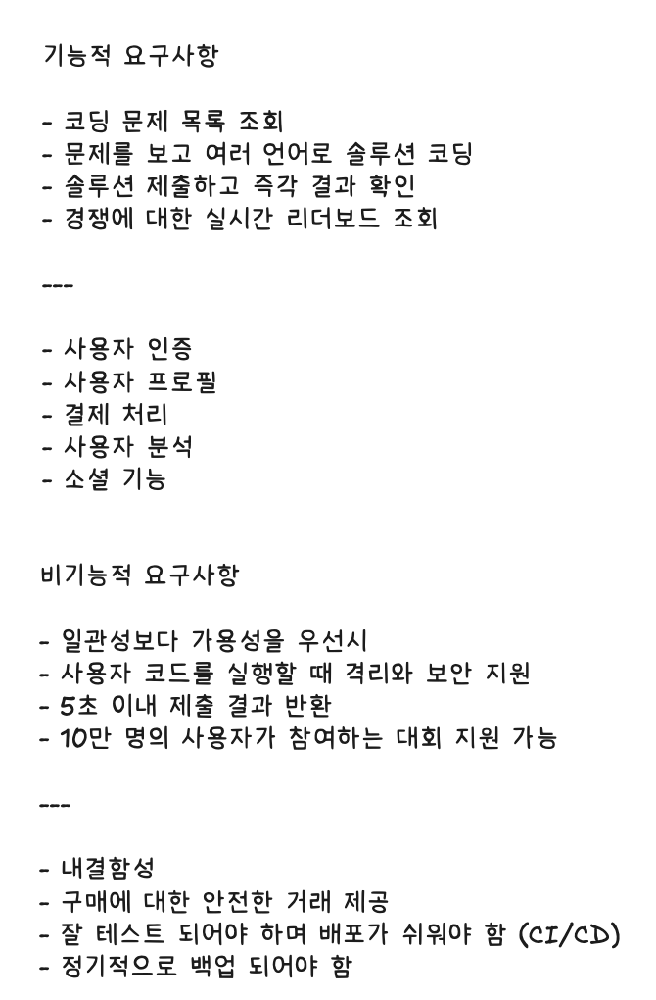

# Design LeetCode

-   [Hello Interview - LeetCode System Design](https://www.hellointerview.com/learn/system-design/problem-breakdowns/leetcode)

## 요구사항



## 첫 설계


-   서버 분리: 가용성을 위해 API 서버와 코드 실행 서버를 격리시킴.
-   비동기 시스템: 수많은 사용자가 수많은 코드 제출을 할테니 큐와 워커로 비동기 처리가 필요함.

## 학습


### 솔루션 제출(코드 제출) 후 즉각적인 피드백을 받아야 함

BAD: API 서버에서 코드 실행

-   코드를 로컬 파일 시스템 파일에 저장하고 실행해서 결과 캡쳐
-   보안 위험: 사용자가 악성 코드를 제출하면? 서버 다운.
-   성능: 코드 실행하면 CPU 사용량이 많아짐
-   격리 안 됨: API 서버와 동일한 프로세스에서 코드를 실행한다는 건 코드가 충돌하면
    서버도 함께 다운된다는 것

GOOD: 가상 머신(VM)에서 코드 실행

-   실제 API 서버의 가상 머신(VM)에서 실행하는 것
-   VM: 서버 위에서 실행되는 격리된 환경. VM 손상돼도 서버에 영향 X
-   VM이 리소스를 많이 사용하고 콜드 스타트도 있음: 리소스 낭비 방지 및
    VM 수명 주기 등의 관리가 필요

GREAT 1: 도커 컨테이너에서 코드 실행

-   격리된 환경을 제공한다는 점에서 VM과 유사하지만 훨씬 가볍고 시작 속도 빠름
-   VM과 컨테이너의 차이:
    -   VM: 물리적 하드웨어, 운영체제, 애플리케이션 등의 전체 복사본이 포함되어
        크기가 커지고 시작속도가 느림. 완전 격리 및 보안 제공 하지만 오버헤드 증가
    -   컨테이너: 호스트 시스템의 커널을 공유하고 애플리케이션 프로세스를 서로 분리함.
        컨테이너는 애플리케이션과 종속성(라이브러리, 바이너리)를 포함하지만 OS는 포함하지 않아서
        가볍고 빠른 시작 시간 제공. 분리성은 비교적 낮지만 리소스 사용 및 확장성 측면에서 더 효율적
-   각 런타임에 대해 필요한 종속성을 설치하고 샌드박스 환경(격리된 환경)에서 코드를 실행하는 컨테이너 생성
-   사용자 제출 건마다 새로운 VM을 구축하는 대신 동일한 컨테이너를 재사용하여 리소스 사용량 절감

GREAT 2: 서버리스(람다) 함수에서 코드 실행

-   서버리스 함수는 작고 상태 비저장이고 이벤트 기반 함수, 트리거(EX: HTTP 요청)에 응답하여 실행됨
-   클라우드 제공업체에서 관리되고 자동 확장 축소가 가능해서 CPU사용량이 많거나 부하가 예측 불가능한 코드를 실행하는데 유용
-   콜드 스타트: 서버리스 함수는 콜드 스타트 시간을 가짐
-   리소스 제한: 서버리스 함수는 리소스 제한이 있어서 리소스 부족이나 성능 병목 현상이 발생하지 않도록 관리해야함

> 서버리스도 좋은 선택이지만, 제출량에 큰 변동이 없을 것 같고 콜드 스타트 지연 시간을 피하고 싶기 때문에 컨테이너 방식을 사용.

---

### 경쟁에 대한 라이브 리더보드를 보여줘야함

Competition

-   90min
-   10 problems
-   최대 10만명 사용자
-   90분 동안 푼 문제의 개수를 기준으로, 동점일 경우
    경기 시작 시간 부터 10문제를 모두 푸는데 걸린 시간을
    기준으로 순위를 매김

competitionId가 있는 모든 항목/행에 대한 제출 테이블을
쿼리한 다음 성공적인 제출 수를 정렬해서 userId로 그룹화 하는 것

```sql
SELECT
    userId,
    count(*) AS passedSubmissions,
    MIN(submittedAt) AS lastSubmissionTime
FROM
    Submissions
WHERE
    competitionId = {competition_id} AND
    passed = TRUE
GROUP BY
    userId
ORDER BY
    passedSubmissions DESC,
    lastSubmissionTime ASC;
```

### 실시간 업데이트

BAD: db 쿼리를 사용한 폴링

-   모든 결과는 주 디비에 저장되고 클라이언트가 몇 초마다 서버에 폴링.
-   폴링마다 디비 쿼리한 후 결과 반환.
-   디비 부하 및 지연 시간: 잦은 쿼리로 인한 부하와 사용자 수 증가하면 지연 시간 증가
-   빈번한 쿼리 및 정렬은 상당한 컴퓨팅 리소스 소모

GOOD: 주기적 업데이트를 통한 캐싱

-   현재 순위표 저장하는 캐시(레디스) 도입, 캐시는 디비에 30초 주기로 쿼리 보내 업데이트
-   완전한 실시간이 아님: 디비 부하는 줄이지만 완전 실시간 X, 업데이트 빈도가 낮으면 경합 상태 발생

GREAT: 주기적 폴링을 사용한 레디스 정렬 세트

-   레디스 정렬 집합을 사용하여 실시간 순위표를 유지하는 동시에 제출 결과를 메인 디비에 저장
-   제출이 처리되면 디비와 레디스 정렬 집합이 모두 업데이트 됨
-   웹소켓보다 구현이 간단하고 거의 실시간에 가까운 업데이트 제공
-   5초 지연 시간은 대부분의 사용자에게 일반적으로 허용 가능

-   Redis Sorted Set는 점수 기반으로 데이터를 정렬해서 저장하고 가져오는 자료구조.
    -   사용자의 총점 또는 해결 시간을 점수로, userId를 값으로 저장.
    -   key는 `competition:leaderboard:{competitionId}`
    -   `ZADD competition:leaderboard:{competitionId} {score}` {userId} 로 점수 저장
    -   `ZREVRANGE competition:leaderboard:{competitionId} 0 N-1 WITHSCORES`: 상위 N명 조회

웹소켓 연결?

-   사용자 수가 적고 5초의 지연 시간이 허용 가능하다는 조건에서는 과도한 조치임.
