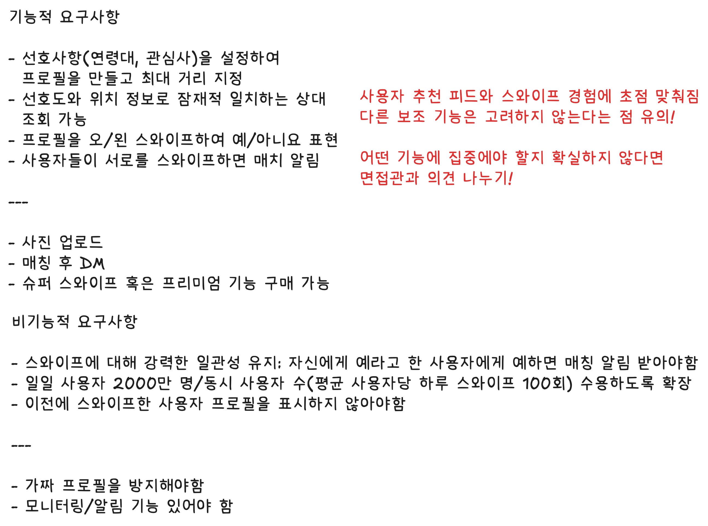
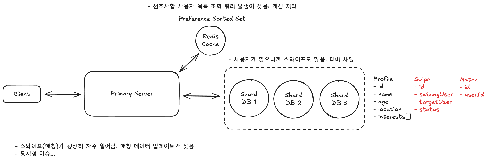
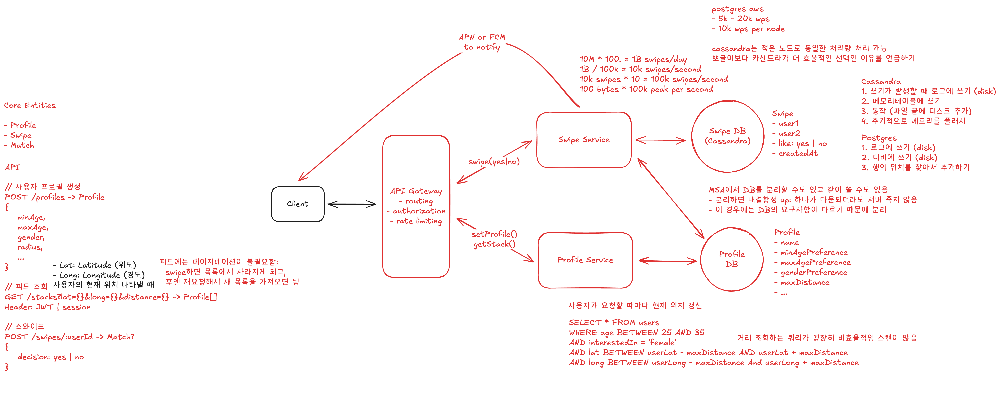
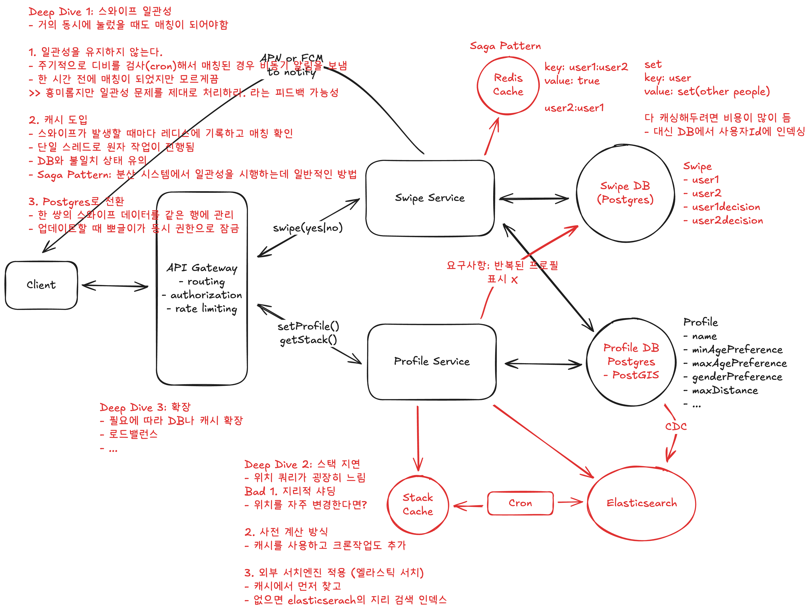

# Design Tinder

-   [Hello Interview - LeetCode System Design](https://www.hellointerview.com/learn/system-design/problem-breakdowns/tinder)

## 요구사항



## 첫 설계



-   선호사항 사용자 목록 조회 쿼리 발생이 잦음: 캐싱 처리
-   사용자가 많으니까 스와이프도 많음: 디비 샤딩

미해결

-   스와이프(매칭)가 굉장히 자주 일어남 -> 매칭 데이터 업데이트가 잦음
-   동시성 이슈 -> 를 시스템 설계 측면에서 고려해야하는건가? 어떻게 고려하는거지

## High Level Design



### 서버 분리

-   두 서비스의 트래픽 패턴이 매우 다르기 때문에 분리(MSA)
-   스택 조회는 비교적 잘 발생하지 않음
-   스와이프 서비스는 계속 확장이 될 수 있어야 함

MSA에서 DB를 분리할 수도 있고 같이 쓸 수도 있음

-   분리하면 내결함성 up: 하나가 다운되더라도 서버 죽지 않음
-   이 경우에는 DB의 요구사항이 다르기 때문에 분리

### 스와이프 발생 빈도

```sql
10M * 100. = 1B swipes/day
1B / 100k = 10k swipes/second
10k swipes * 10 = 100k swipes/second
100 bytes * 100k peak per second
```

postgres aws

-   5k - 20k wps
-   10k wps per node

cassandra는 적은 노드로 동일한 처리량 처리 가능
뽀글이보다 카산드라가 더 효율적인 선택인 이유를 언급하기

Cassandra

1. 쓰기가 발생할 때 로그에 쓰기 (disk)
2. 메모리테이블에 쓰기
3. 동작 (파일 끝에 디스크 추가)
4. 주기적으로 메모리를 플러시

Postgres

1. 로그에 쓰기 (disk)
2. 디비에 쓰기 (disk)
3. 행의 위치를 찾아서 추가하기

## Deep Dive



### Deep Dive 1: 스와이프 일관성

-   거의 동시에 눌렀을 때도 매칭이 되어야함

1. 일관성을 유지하지 않는다.

-   주기적으로 디비를 검사(cron)해서 매칭된 경우 비동기 알림을 보냄
-   한 시간 전에 매칭이 되었지만 모르게끔
    > > 흥미롭지만 일관성 문제를 제대로 처리하라. 라는 피드백 가능성

2. 캐시 도입

-   스와이프가 발생할 때마다 레디스에 기록하고 매칭 확인
-   단일 스레드로 원자 작업이 진행됨
-   DB와 불일치 상태 유의
-   Saga Pattern: 분산 시스템에서 일관성을 시행하는데 일반적인 방법

3. Postgres로 전환

-   한 쌍의 스와이프 데이터를 같은 행에 관리
-   업데이트할 때 뽀글이가 동시 권한으로 잠금

### Deep Dive 2: 스택 지연

-   위치 쿼리가 굉장히 느림
    Bad 1. 지리적 샤딩
-   위치를 자주 변경한다면?

2. 사전 계산 방식

-   캐시를 사용하고 크론작업도 추가

3. 외부 서치엔진 적용 (엘라스틱 서치)

-   캐시에서 먼저 찾고
-   없으면 elasticserach의 지리 검색 인덱스

### Deep Dive 3: 확장

-   필요에 따라 DB나 캐시 확장
-   로드밸런스
-   ...

---


