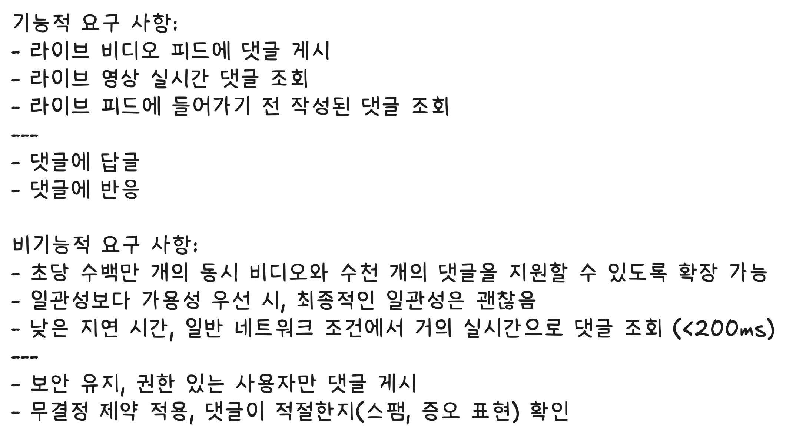
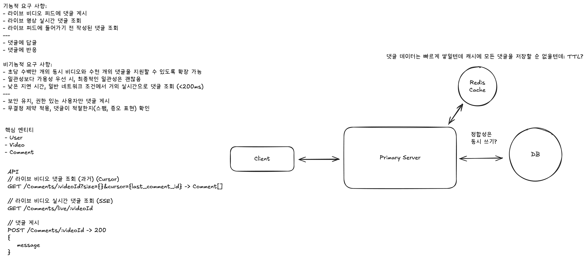
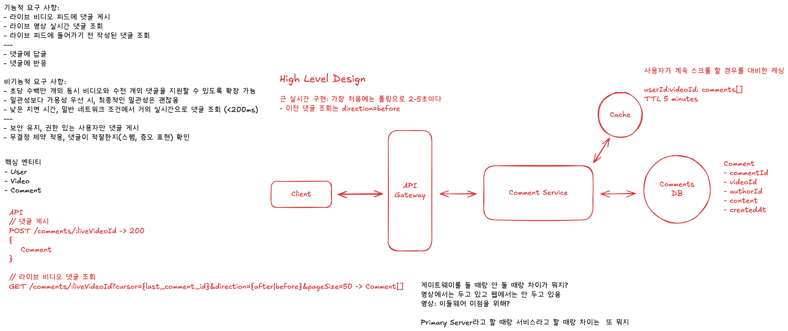
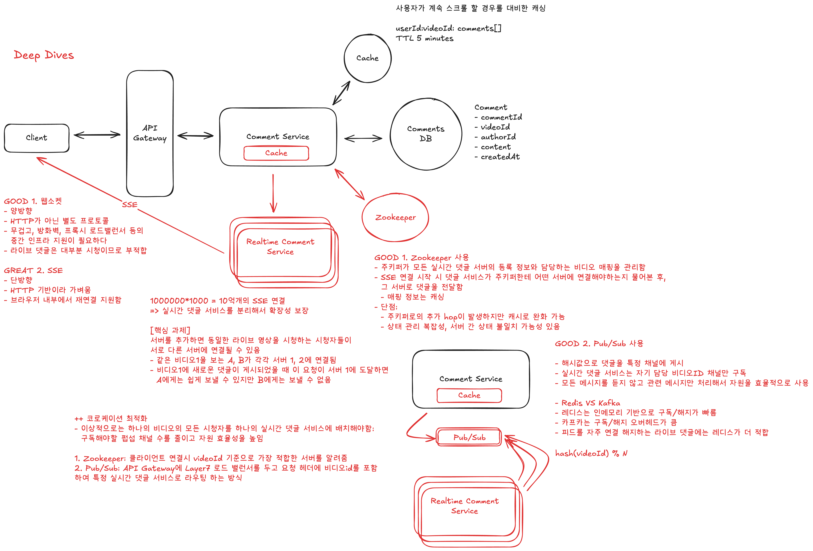

# Design FB Live Comments

-   [Hello Interview - FB Live Comments System Design](https://www.hellointerview.com/learn/system-design/problem-breakdowns/fb-live-comments)

## 요구사항

## 첫 설계

댓글 데이터는 빠르게 쌓일텐데 캐시에 모든 댓글을 저장할 순 없을텐데: TTL?

## High Level Design

근 실시간 구현: 가장 처음에는 폴링으로 2-5초마다

-   이전 댓글 조회는 direction=before

사용자가 계속 스크롤 할 경우를 대비한 캐싱

userId:videoId: comments[]
TTL 5 minutes

## Deep Dive

### Deep Dive 1: 실시간 댓글 조회

GOOD 1. 웹소켓

-   양방향
-   HTTP가 아닌 별도 프로토콜
-   무겁고, 방화벽, 프록시 로드밸런서 등의
    중간 인프라 지원이 필요하다
-   라이브 댓글은 대부분 시청이므로 부적합

GREAT 2. SSE

-   단방향
-   HTTP 기반이라 가벼움
-   브라우저 내부에서 재연결 지원함

1000000\*1000 = 10억개의 SSE 연결
=> 실시간 댓글 서비스를 분리해서 확장성 보장

### Deep Dive 2: 서버를 분리했을 때의 정합성

[핵심 과제]
서버를 추가하면 동일한 라이브 영상을 시청하는 시청자들이
서로 다른 서버에 연결될 수 있음

-   같은 비디오1을 보는 A, B가 각각 서버 1, 2에 연결됨
-   비디오1에 새로운 댓글이 게시되었을 때 이 요청이 서버 1에 도달하면
    A에게는 쉽게 보낼 수 있지만 B에게는 보낼 수 없음

GOOD 1. Zookeeper 사용

-   주키퍼가 모든 실시간 댓글 서버의 등록 정보와 담당하는 비디오 매핑을 관리함
-   SSE 연결 시작 시 댓글 서비스가 주키퍼한테 어떤 서버에 연결해야하는지 물어본 후,
    그 서버로 댓글을 전달함
    -   매핑 정보는 캐싱
-   단점:
    -   주키퍼로의 추가 hop이 발생하지만 캐시로 완화 가능
    -   상태 관리 복잡성, 서버 간 상태 불일치 가능성 있음

GOOD 2. Pub/Sub 사용

-   해시값으로 댓글을 특정 채널에 게시
-   실시간 댓글 서비스는 자기 담당 비디오ID 채널만 구독
-   모든 메시지를 듣지 않고 관련 메시지만 처리해서 자원을 효율적으로 사용

-   Redis VS Kafka
-   레디스는 인메모리 기반으로 구독/해지가 빠름
-   카프카는 구독/해지 오버헤드가 큼
-   피드를 자주 연결 해지하는 라이브 댓글에는 레디스가 더 적합

++ 코로케이션 최적화

-   이상적으로는 하나의 비디오의 모든 시청자를 하나의 실시간 댓글 서비스에 배치해야함:
    구독해야할 펍섭 채널 수를 줄이고 자원 효율성을 높임

1. Zookeeper: 클라이언트 연결시 videoId 기준으로 가장 적합한 서버를 알려줌
2. Pub/Sub: API Gateway에 Layer7 로드 밸런서를 두고 요청 헤더에 비디오id를 포함하여 특정 실시간 댓글 서비스로 라우팅 하는 방식
