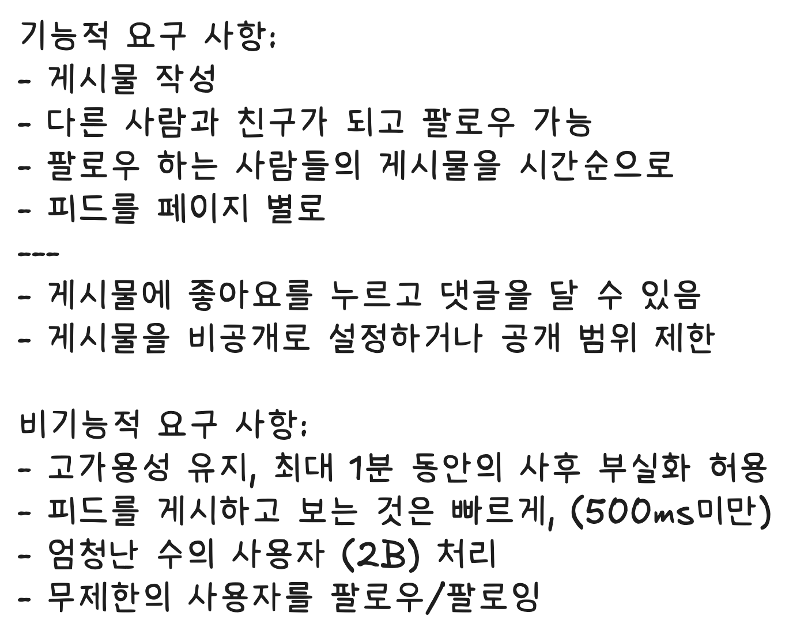
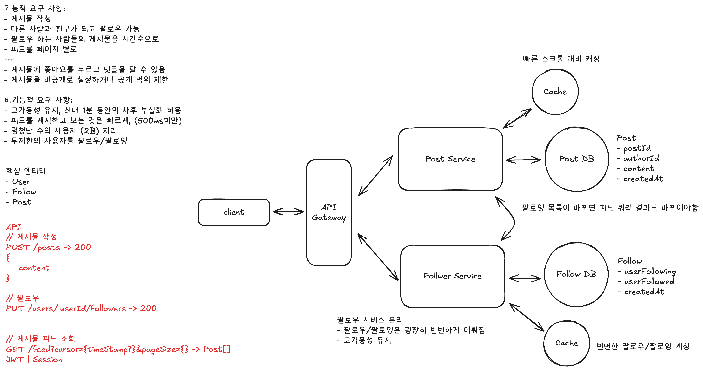
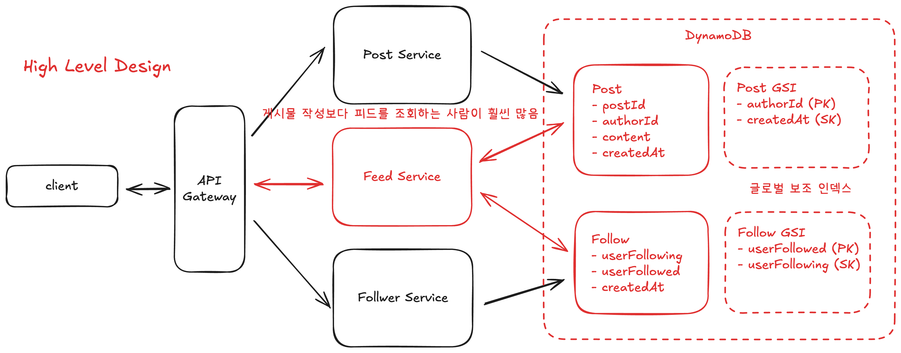
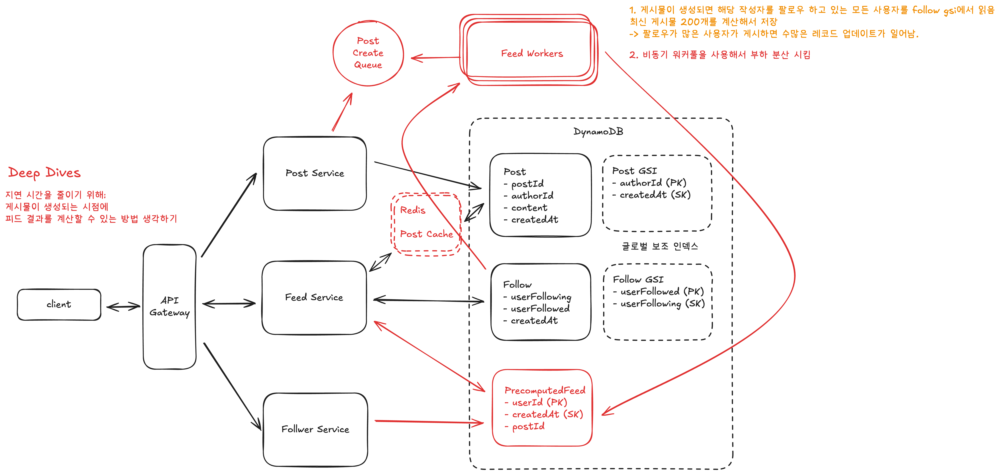

# Design FB News Feed

-   [Hello Interview - FB News Feed System Desgin](https://www.hellointerview.com/learn/system-design/problem-breakdowns/fb-news-feed)

## 요구사항

## 첫 설계

팔로우 서비스 분리

-   팔로우/팔로잉은 굉장히 빈번하게 이뤄짐
-   고가용성 유지

## High Level Design

-   피드 서스 분리: 게시물 작성보다 피드를 조회하는 사람이 훨씬 많음
-   글로벌 보조 인덱스 사용

## Deep Dives

### Deep Dive 1: 지연 시간 줄이기

지연 시간을 줄이기 위해 게시물이 생성되는 시점에 피드 결과를 계산할 수 있는 방법 생각하기

1. 게시물이 생성되면 해당 작성자를 팔로우 하고 있는 모든 사용자를 follow gsi에서 읽음

-   최신 게시물 200개를 계산해서 저장
    -> 팔로우가 많은 사용자가 게시하면 수많은 레코드 업데이트가 일어남.

2. 비동기 워커풀을 사용해서 부하 분산 시킴
