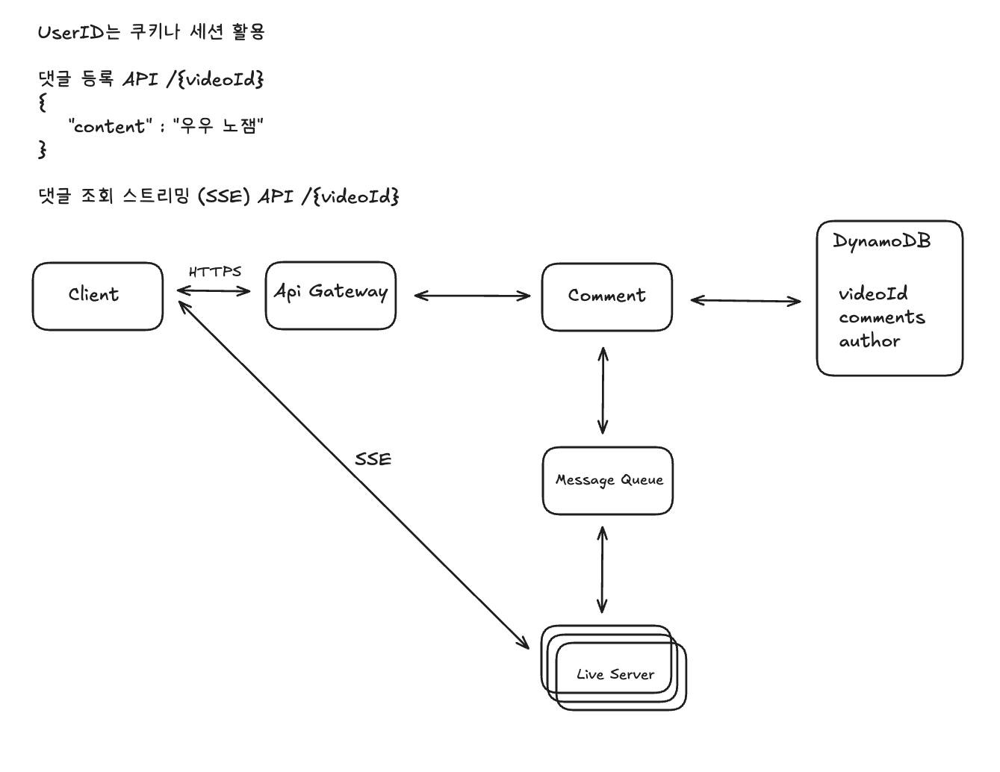

# Facebook Live Comments 시스템 설계 분석

## 1. 왜 Kafka보다 Redis Pub-Sub?

Redis Pub/Sub은 Kafka보다 특정 시나리오에서 더 유리할 수 있습니다.

### 1.1 구독/구독 해지 오버헤드
- **Kafka의 한계**: 채널을 구독하고 구독 해지하는 데 많은 오버헤드가 발생
- **Redis의 장점**: 인메모리(in-memory) 기반으로 잦은 구독/구독 해지 작업을 훨씬 더 쉽게 처리

### 1.2 사용자 행동 패턴
- 라이브 댓글 시스템에서 사용자는 피드를 스크롤하면서 라이브 비디오를 클릭하지 않는 경우 매우 빠르게 구독하고 구독 해지
- 사용자 활동이 빈번하여 채널 구독 및 구독 해지가 빠르게 발생하는 환경에서는 Redis Pub/Sub의 낮은 오버헤드가 더 적합

## 2. 왜 Pub-Sub보다 Dispatcher 방식?

### 2.1 Pub-Sub과 Dispatcher 방식의 차이

#### 메시지 전파 방식
**Pub/Sub 방식**:
- Comment Management Service가 새로운 댓글을 Pub/Sub 시스템(메시지 버스)에 발행
- 모든 Realtime Comment Service 인스턴스들이 이 채널을 구독
- 각 Realtime Comment Service는 수신된 댓글이 자신에게 연결된 클라이언트와 관련 있는지 스스로 확인
- "소방 호스로 물 마시기(drinking through a fire hose)"에 비유 - 모든 서버가 모든 댓글을 받아서 불필요한 검사

**Dispatcher 방식**:
- Dispatcher (예: Zookeeper)는 특정 LiveVideoId와 이를 담당하는 Realtime Messaging Service 인스턴스 간의 매핑 정보를 중앙에서 관리
- Comment Management Service는 새로운 댓글이 발생했을 때 Dispatcher에게 해당 LiveVideoId를 시청하는 사용자들을 담당하는 Realtime Messaging Service가 어디인지 문의
- 그 특정 서버에만 댓글을 전송

#### 상태 관리 및 라우팅
**Pub/Sub 방식**:
- Realtime Comment Service 인스턴스 자체적으로 어떤 LiveVideoId의 클라이언트가 연결되어 있는지 인메모리 매핑을 통해 관리
- 클라이언트의 초기 연결을 특정 서버로 유도하는 중앙화된 라우팅 로직이 부족
- 파티셔닝을 통해 불필요한 메시지 수신을 줄일 수 있지만, 완벽한 공동 배치는 어려움

**Dispatcher 방식**:
- Dispatcher가 Realtime Messaging Service들의 등록 정보를 유지
- 어떤 비디오를 담당하는지, 몇 명의 사용자가 연결되어 있는지 등을 파악
- 새로운 클라이언트가 특정 LiveVideoId로 연결을 요청하면, Dispatcher는 가장 적절한 Realtime Messaging Service의 주소를 제공

### 2.2 왜 Pub-Sub보다 유리? (공동 배치 관점)

#### 자원 효율성 증대
- 이상적으로는 특정 라이브 비디오의 모든 시청자를 하나의 Realtime Comment Service에 배치(collocate)하는 것이 좋음
- 여러 서버가 동일한 비디오 ID에 대한 메시지를 불필요하게 구독하고 처리하는 리소스 낭비를 크게 줄일 수 있음
- 예: 비디오 1을 시청하는 세 명의 사용자가 무작위로 다른 서버에 할당되는 대신, 모두 동일한 Realtime Comment Service 서버에 연결

#### Dispatcher의 공동 배치 용이성
- 새로운 클라이언트가 특정 LiveVideoId로 연결을 요청할 때, Dispatcher는 이미 해당 비디오를 시청하는 다른 사용자들이 어느 Realtime Comment Service에 연결되어 있는지 확인 가능
- 이 정보를 바탕으로 새로운 클라이언트를 동일한 Realtime Comment Service 서버로 연결하도록 지시하여 공동 배치를 용이하게 함

#### Pub/Sub의 공동 배치 난이도
- Pub/Sub 방식에서는 중앙 관리자가 어떤 서버가 어떤 비디오를 담당하는지에 대한 매핑 정보를 직접 관리하지 않음
- 공동 배치를 구현하려면 API Gateway를 통해 LiveVideoId를 헤더에 포함하고, 별도의 서비스가 이를 라우팅하는 등 추가적인 복잡성이 필요

## 3. Layer 7 Load Balancer

### 3.1 트래픽 라우팅
Layer 7 Load Balancer는 Commenter Client로부터 들어오는 두 가지 유형의 연결을 처리합니다:

1. **HTTPS를 통한 /create 요청**: Comment Management Service로 라우팅
2. **SSE를 통한 실시간 연결**: LiveVideoId를 기반으로 Realtime Messaging Service로 연결

### 3.2 Layer 7의 기능
- HTTP 헤더와 같은 애플리케이션 계층 정보를 검사하여 라우팅 결정
- 단순히 IP 주소와 포트 번호만을 보는 Layer 4 로드 밸런서보다 훨씬 더 정교한 트래픽 관리 가능

### 3.3 공동 배치 지원 (Pub/Sub의 경우)
- 중앙 디스패처 방식이 아닌 Pub/Sub 방식을 선택하여 공동 배치를 달성하려 한다면
- API Gateway를 통해 LiveVideoId를 HTTP 헤더에 포함시키고, 이 정보를 바탕으로 요청을 올바른 Realtime Comment Service로 라우팅
- 동일 비디오를 시청하는 사용자들을 특정 서버로 유도하여 공동 배치를 지원

## 4. 결론

Facebook Live Comments 시스템은 다음과 같은 핵심 전략을 사용합니다:

1. **Redis Pub/Sub**: 빠른 구독/구독 해지가 필요한 환경에서 Kafka보다 유리
2. **Dispatcher 방식**: 공동 배치를 통한 자원 효율성 증대
3. **Layer 7 Load Balancer**: 애플리케이션 계층 정보를 기반으로 한 정교한 트래픽 관리

두 방식 모두 유효하지만, 대규모 프로덕션 시스템에서 최적화된 확장성 및 리소스 효율성을 위한 '공동 배치'가 중요한 고려 사항이며, 디스패처 방식이 이를 더 효과적으로 구현할 수 있어 선택됩니다.
