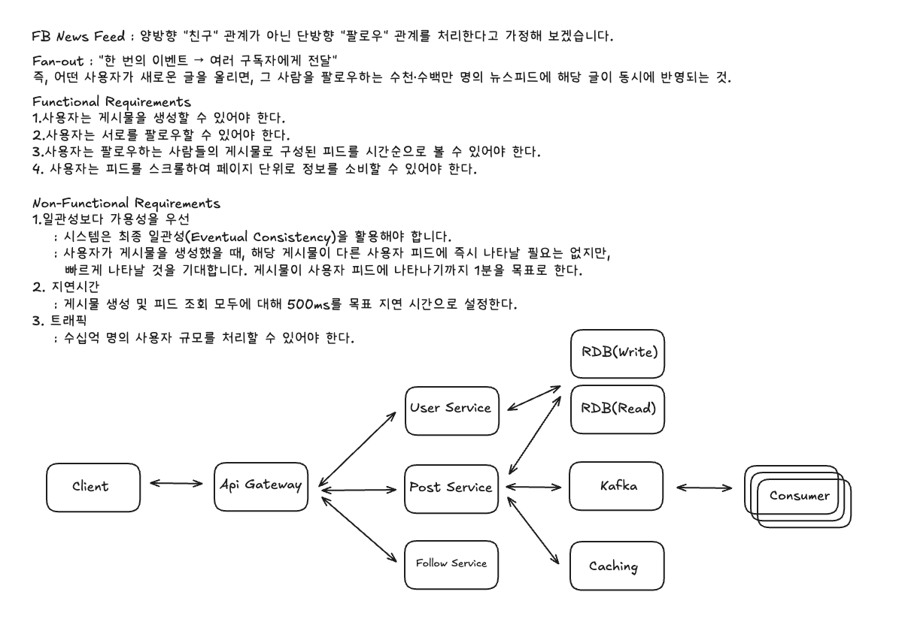

# Facebook News Feed 시스템 설계 분석



## 1. DynamoDB 및 GSI (Global Secondary Index) 이해

### 1.1 와이드 컬럼 스토어 (Wide Column Store)
- DynamoDB는 Cassandra와 같은 확장 가능한 와이드 컬럼 스토어의 한 종류
- 관계형 데이터베이스(RDB)와 달리 유연한 스키마와 수평 확장에 유리
- NoSQL 데이터베이스의 장점을 활용한 설계

### 1.2 파티션 키 (Partition Key) 및 정렬 키 (Sort Key)
DynamoDB에서 데이터를 효율적으로 쿼리하려면 파티션 키와 정렬 키를 잘 설계하는 것이 핵심입니다.

**예시: Follow 테이블**
- 파티션 키: `user_following` (팔로우하는 사용자)
- 정렬 키: `user_followed` (팔로우받는 사용자)
- 이를 통해 특정 사용자가 팔로우하는 모든 사용자를 쉽게 나열할 수 있습니다.

### 1.3 글로벌 보조 인덱스 (GSI - Global Secondary Index)
GSI는 DynamoDB의 매우 중요한 기능입니다.

#### GSI의 특징
- 기본 테이블과 다른 파티션 키와 정렬 키를 가질 수 있는 보조 인덱스
- 기본 키로는 불가능한 다양한 쿼리 패턴을 지원
- Cassandra의 2차 인덱스와 유사하지만, DynamoDB 내부에서 일관성 있게 관리

#### GSI 활용 예시
1. **역방향 쿼리**: "특정 사용자를 팔로우하는 모든 사용자를 알려줘"
   - Follower GSI: `user_followed`를 파티션 키로, `user_following`을 정렬 키로 설정

2. **시간순 조회**: 게시물을 생성 시간순으로 조회
   - Post GSI: `user_id`를 파티션 키로, `created_at`을 정렬 키로 설정

#### GSI 제한 사항
- GSI를 통한 범위 요청에서 한 번에 1메가바이트 이하의 데이터만 반환
- 팔로워가 매우 많은 계정에는 문제가 될 수 있지만, 대부분의 사용자에게는 해당되지 않음

## 2. 현재 아키텍처와의 차이점 및 개선점

### 2.1 데이터베이스 선택의 차이
**현재 아키텍처**: RDB 사용
**비디오 제안**: DynamoDB 사용

**고려사항**:
- RDB를 사용하더라도 인덱스를 통한 쿼리 효율성 개선이 중요
- GSI와 유사한 개념으로 복합 인덱스 설계 필요
- 수평 확장성 vs 일관성의 트레이드오프 고려

### 2.2 데이터 모델링의 구체화 부족

#### 현재 아키텍처의 문제점
- User, Post, Follow 서비스와 RDB를 보여주지만, 각 테이블의 정확한 스키마를 명시하지 않음
- 파티션 키, 정렬 키, GSI 등의 구체적인 설계가 부족

#### 개선된 스키마 설계

**Follow 테이블 스키마**
```sql
-- 기본 테이블
Partition Key: user_following
Sort Key: user_followed

-- Follower GSI (역방향 쿼리용)
Partition Key: user_followed
Sort Key: user_following
```

**Post 테이블 스키마**
```sql
-- 기본 테이블
Partition Key: post_id
Sort Key: (없음)

-- User Posts GSI (사용자별 게시물 조회용)
Partition Key: user_id
Sort Key: created_at
```

### 2.3 읽기 성능 최적화 전략 부족

#### 현재 아키텍처의 한계
- Kafka와 Consumer가 있지만 구체적인 목적과 구현 방식이 명시되지 않음
- 읽기 작업이 많은 뉴스피드 특성을 고려한 최적화 전략 부족

#### Fan-out on Write (푸시 모델) 전략
- 게시물 생성 시 피드를 미리 계산해두는 방식
- 새로운 **Precomputed Feed 테이블** 도입 필요

**Precomputed Feed 테이블 구조**
```sql
Partition Key: user_id
Sort Key: post_timestamp
Attributes: post_id, author_id, content_type
```

**비동기 처리 흐름**
1. 게시물 생성 → Post 테이블에 저장
2. Kafka에 팬아웃 작업 메시지 전송
3. Async Worker Pool이 팔로워들의 Precomputed Feed에 게시물 ID 추가
4. 피드 조회 시 Precomputed Feed에서 빠르게 데이터 조회

### 2.4 스케일 문제 해결 전략 부족

#### 메가 계정 처리 (하이브리드 접근 방식)
**문제**: 저스틴 비버처럼 수억 명의 팔로워를 가진 계정의 경우, 게시물 생성 시 모든 팔로워의 피드에 미리 쓰는 것이 엄청난 쓰기 부하를 유발

**해결 방법**:
- 팔로우 관계 테이블에 `is_precomputed` 플래그 추가
- 메가 계정의 팔로워에게는 피드를 미리 계산하지 않음
- 피드 조회 시점에 동적으로 가져와 병합

```sql
-- Follow 테이블에 추가할 필드
is_precomputed: boolean
follower_count: integer
```

#### 핫키(Hotkey) 또는 핫샤드(Hot Shard) 문제
**문제**: 매우 인기 있는 게시물이 많은 사용자에게 동시에 조회될 때, 특정 데이터베이스 파티션에 부하가 집중

**해결 방법**:
- **분산 캐시(Distributed Cache)** 도입
- 캐시마저 핫키가 되는 문제를 해결하기 위해 여러 캐시 인스턴스에 요청을 무작위로 분산
- Consistent Hashing을 통한 캐시 분산

### 2.5 API 디자인 및 페이지네이션 구현

#### 현재 아키텍처의 부족한 점
- 페이지네이션 구현 방식이 명시되지 않음
- 무한 스크롤 경험을 위한 최적화 부족

#### 개선된 API 디자인
```http
GET /feed?page_size=20&cursor=1640995200
```

**페이지네이션 방식**:
- 시간 기반의 커서(timestamp)를 통한 페이지네이션
- 사용자가 마지막으로 본 게시물의 타임스탬프를 커서로 사용
- 그보다 오래된 다음 페이지의 게시물들을 가져오는 방식

## 3. 성능 최적화 전략

### 3.1 읽기 최적화
- Precomputed Feed 테이블을 통한 빠른 피드 조회
- GSI를 활용한 효율적인 쿼리 패턴
- 분산 캐시를 통한 핫키 문제 해결

### 3.2 쓰기 최적화
- 비동기 팬아웃을 통한 쓰기 부하 분산
- 메가 계정에 대한 하이브리드 접근 방식
- Kafka를 통한 메시지 큐 활용

### 3.3 확장성
- 수평 확장 가능한 DynamoDB 활용
- 마이크로서비스 아키텍처
- 분산 시스템 설계

## 4. 결론

Facebook News Feed 시스템은 대규모 사용자를 지원하기 위해 다음과 같은 핵심 전략을 사용합니다:

1. **DynamoDB와 GSI**를 활용한 효율적인 데이터 모델링
2. **Fan-out on Write** 전략을 통한 읽기 성능 최적화
3. **하이브리드 접근 방식**을 통한 메가 계정 처리
4. **분산 캐시**를 통한 핫키 문제 해결
5. **비동기 처리**를 통한 시스템 부하 분산

현재 아키텍처에서 고려하지 못했던 부분들을 보완하여, 수십억 명의 사용자에게 실시간으로 개인화된 뉴스피드를 제공할 수 있는 시스템을 구축할 수 있습니다.

