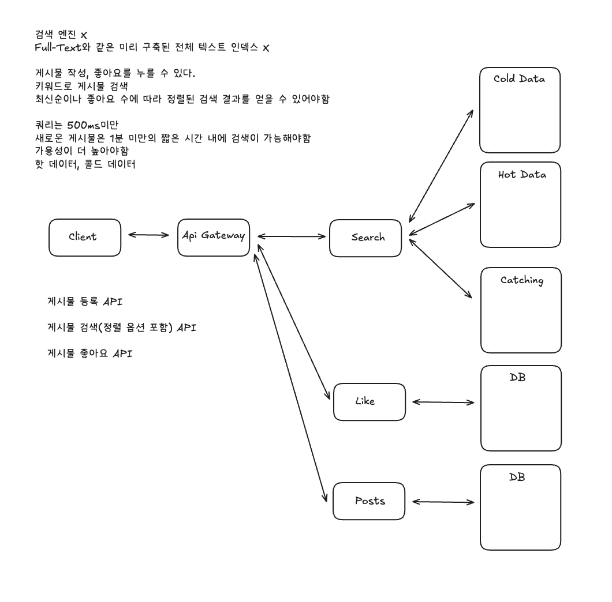

# Facebook Post Search 시스템 설계 분석

## 1. 데이터 Ingestion (색인) 파이프라인의 부재

### 1.1 누락된 Ingestion Service
- 게시물(Posts)과 좋아요(Like) 서비스가 생성/업데이트될 때 검색 인덱스(Hot Data/Cold Data)를 업데이트하는 과정이 명확히 표시되지 않음
- **Ingestion Service**가 별도로 존재해야 하며, 이는 Post DB 및 Likes DB에서 **CDC (Change Data Capture)**를 통해 데이터를 읽어 토큰화하고 검색 인덱스에 쓰는 역할

### 1.2 비동기 처리 (Kafka)
- 높은 쓰기 처리량(특히 좋아요는 게시물 생성보다 10배 많음)과 장애 허용을 위해 Post DB 및 Likes Count Cache에서 Kafka와 같은 메시지 큐로 이벤트를 발행
- Ingestion Service가 Kafka 토픽에서 데이터를 읽어 처리하는 비동기 처리가 권장됨
- 현재 다이어그램에는 이러한 비동기 큐가 누락됨

## 2. 검색 인덱스 상세 구조 및 저장 전략

### 2.1 Inverted Index (역색인)
- 빠른 검색을 위해 **Inverted Index**가 핵심 데이터 구조로 사용됨
- 정렬(최신순/좋아요순)을 위해 Redis Sorted Set과 같은 구조를 활용

### 2.2 샤딩/파티셔닝 전략
- Hot Data가 Redis와 같은 인메모리 스토어라면, 높은 쓰기/읽기 볼륨을 처리하기 위한 **Redis Cluster** 구성 필요
- 키워드 또는 Post ID 기반의 샤딩/파티셔닝 전략이 중요
- 현재 다이어그램에 명시되지 않음

## 3. 캐싱 계층의 세분화

### 3.1 다계층 캐싱 전략
현재 "Catching"이라는 일반적인 캐싱만 언급되어 있지만, 여러 계층의 캐싱 전략이 필요:

#### Search Service 내부 캐시
- 검색 서비스가 검색 인덱스에 중복 호출을 보내는 것을 방지

#### CDN (Content Delivery Network)
- 전 세계적으로 분산된 캐시를 통해 사용자에게 가장 가까운 곳에서 검색 결과를 제공
- 레이턴시를 최소화

### 3.2 Cache TTL 설정
- 새 게시물이 1분 이내에 검색되어야 한다는 요구사항을 충족시키기 위해 캐시의 TTL(Time To Live)을 1분으로 설정하는 것이 중요

## 4. 쓰기 최적화 기법

### 4.1 좋아요 이벤트 배치 처리 (Batching)
- 좋아요 이벤트는 게시물 생성보다 훨씬 자주 발생
- 30초와 같은 일정 시간 동안 좋아요 이벤트를 모아서 한 번에 처리하는 방식

### 4.2 좋아요 수 로그 변환 (Logarithmic Likes)
- 좋아요 수를 정확히 기록하는 대신, 2의 거듭제곱과 같이 중요한 임계값을 넘을 때만 인덱스를 업데이트
- 최종 검색 서비스에서 정확한 좋아요 수를 가져와 재정렬하는 방식으로 쓰기 볼륨을 줄임

## 5. 핫/콜드 데이터 관리 메커니즘

### 5.1 Count-Min Sketch 활용
- **Count-Min Sketch**와 같은 확률적 데이터 구조를 사용하여 키워드별 접근 빈도를 근사치로 파악
- 접근 빈도가 낮은 키워드를 콜드 스토리지(예: S3)로 이동

### 5.2 데이터 이동 기준
- 핫 데이터와 콜드 데이터를 구분하고 이동시키는 기준 및 메커니즘이 명시되어 있지 않음
- 접근 빈도, 최신성, 인기도 등을 종합적으로 고려한 이동 전략 필요

## 6. 다중 키워드 검색 처리

### 6.1 N-gram 인덱싱
- "Taylor Swift"와 같은 다중 키워드 검색을 위해 **Bi-gram (두 단어 조합)** 또는 **N-gram**을 검색 인덱스에 추가
- Count-Min Sketch를 활용하여 인기 있는 Bi-gram만 인덱스에 추가하여 저장 공간을 최적화

### 6.2 검색 알고리즘
- 다중 키워드 검색을 위한 효율적인 알고리즘 구현
- 키워드 간의 관계성과 우선순위를 고려한 검색 결과 정렬

## 7. 시스템 볼륨 추정 (Estimates)

### 7.1 구체적인 수치 추정
시스템 설계 초기 단계에서 다음과 같은 구체적인 수치 추정이 중요:

- **사용자 수**: 10억 명
- **게시물 생성**: 10,000 TPS
- **좋아요**: 100,000 TPS
- **검색 쿼리**: 10,000 TPS
- **스토리지 요구사항**: 3.6PB

### 7.2 설계 의사결정 근거
- 이러한 수치적 근거를 통해 시스템이 **쓰기 중심(write-heavy)**임을 파악
- 이를 바탕으로 설계 방향을 결정하는 과정이 중요
- 현재 다이어그램의 요구사항 목록에 직접 포함되지는 않았지만, 설계 의사결정에 매우 중요한 역할

## 8. 개선된 아키텍처 구성요소

### 8.1 추가 필요한 컴포넌트
1. **Ingestion Service**: CDC를 통한 데이터 수집 및 토큰화
2. **Kafka**: 비동기 메시지 큐
3. **Redis Cluster**: 샤딩된 인메모리 스토리지
4. **Count-Min Sketch Service**: 접근 빈도 추적
5. **CDN**: 전 세계 분산 캐시

### 8.2 데이터 흐름
1. Post/Like 생성 → CDC → Kafka
2. Ingestion Service가 Kafka에서 데이터 읽기
3. 토큰화 및 Inverted Index 업데이트
4. Hot/Cold 데이터 분류 및 이동
5. 검색 요청 처리 및 캐싱

## 9. 결론

Facebook Post Search 시스템은 다음과 같은 핵심 전략을 사용합니다:

1. **데이터 Ingestion 파이프라인**: CDC와 Kafka를 통한 비동기 처리
2. **Inverted Index**: 빠른 검색을 위한 핵심 데이터 구조
3. **다계층 캐싱**: Search Service 내부 캐시와 CDN
4. **쓰기 최적화**: 배치 처리와 로그 변환
5. **핫/콜드 데이터 관리**: Count-Min Sketch를 통한 효율적인 데이터 이동
6. **N-gram 인덱싱**: 다중 키워드 검색 지원

현재 아키텍처는 핵심 구성 요소를 잘 파악하고 있지만, 높은 처리량과 가용성을 보장하기 위한 심화된 고려사항들을 추가하면 더욱 견고하고 포괄적인 시스템 디자인이 될 것입니다.
